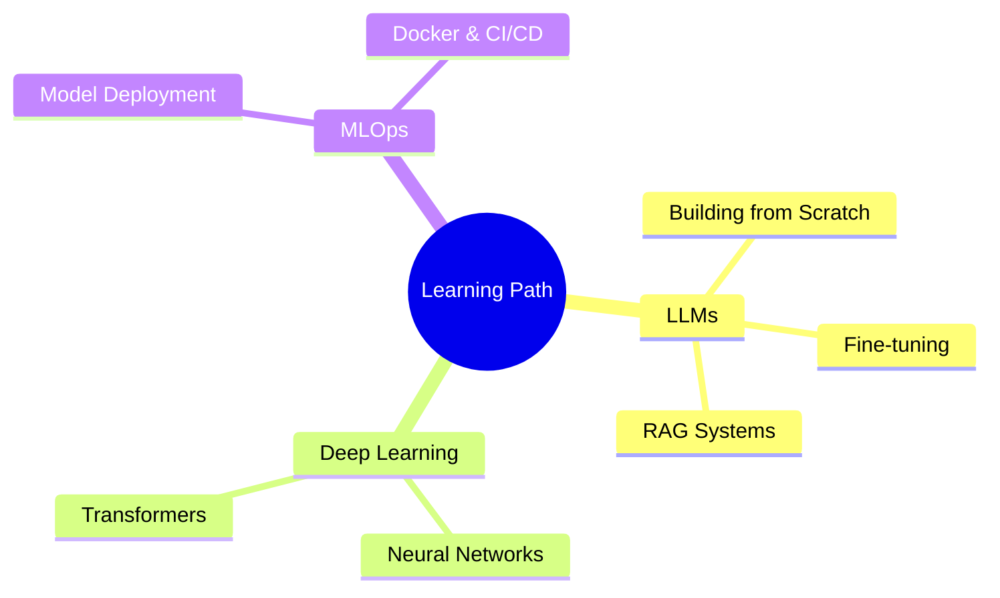

  
<!-- Header Banner -->

<!-- Typing Animation -->

<!-- Social Badges -->

  
  

---

## 🧑‍💻 About Me

👋 Hi, I'm **Ibrahim Youssouf Abdelatif**, a Junior Data Scientist with an **MSc in Applied Mathematics** from **Paris-Dauphine PSL**.

🔧 **Languages:** Python • R • C++ • SQL

🎯 **Current Focus:** Machine Learning, Deep Learning, LLMs, Reinforcement Learning & GenAI

💡 **Fun Fact:** I believe every dataset tells a story waiting to be discovered! 📊

  

---

## 🛠️ Tech Stack

### Languages

### Machine Learning & Data Science

### Generative AI & LLMs

### Visualization

### Tools & Platforms

## 🚀 Featured Projects

| Project | Description | Tech |
|---------|-------------|------|
| 🏦 [**Credit-Risk-Modelling**](https://github.com/latifo01/Credit-Risk-Modelling) | ML-based credit risk assessment and prediction |   |
| 🤖 [**Reinforcement-Learning-Project**](https://github.com/latifo01/Reinforcement-Learning-Project) | MDP & Dynamic Programming implementation |  |
| 🫀 [**memoire_ecg**](https://github.com/latifo01/memoire_ecg) | ECG signal analysis & Medical AI |  |
| 💼 [**Portfolio Website**](https://github.com/latifo01/portofolio) | Personal portfolio showcasing projects |   |

---

## 📚 Currently Learning

---

## 🤝 Let's Connect!

  
I'm always open to collaborating on **Data Science**, **Machine Learning**, or **GenAI** projects!

---

  
<!-- Footer -->

